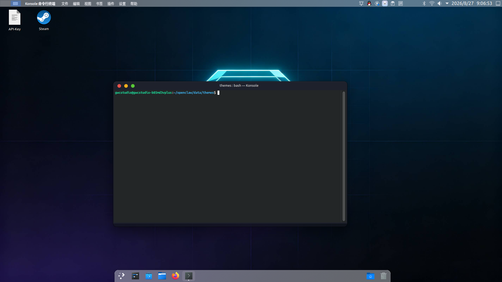
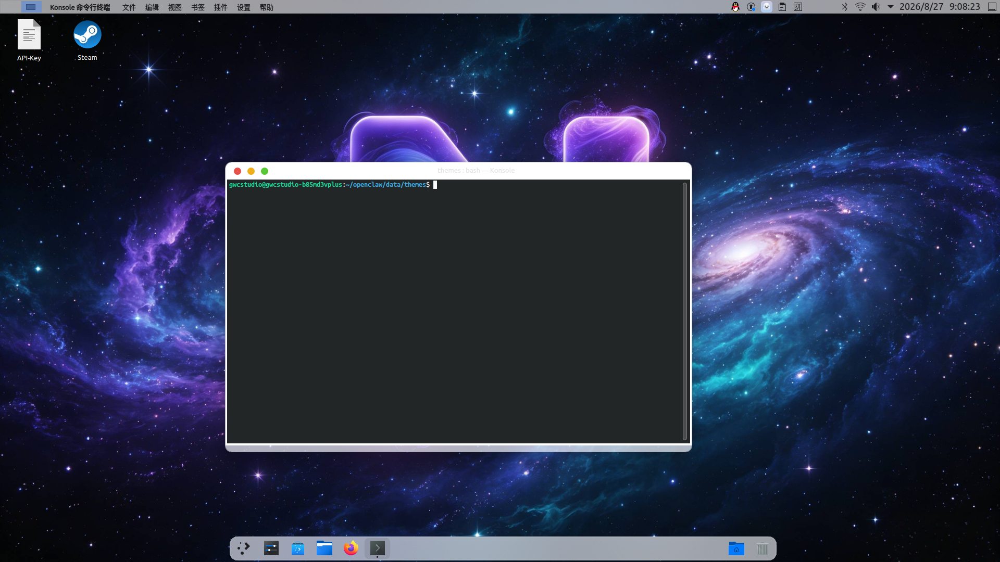

# 🌌 Nebula-OS

**为游戏而生的 Linux 生态**

Nebula-OS 是一个专注于游戏体验的 Linux 生态系统，致力于提供**低资源占用、开箱即用、高颜值**的游戏环境。本项目集合了桌面主题、性能优化和 AI 辅助工具，让 Linux 游戏体验更接近原生主机。

[](https://github.com/GWC-Studio/Nebula-OS/stargazers)
[](https://github.com/GWC-Studio/Nebula-OS/issues)
[](LICENSE)
[](docs/)

---

## 🎯 项目理念

> *「让 Linux 游戏不再需要折腾」*

Nebula-OS 的每个组件都围绕一个核心目标：**让玩家专注于游戏，而不是调试系统**。无论你是资深 Linux 用户还是刚刚从 Windows 转过来的游戏玩家，Nebula-OS 都能让你快速获得流畅、稳定、美观的游戏体验。

---

## 🧩 生态组件

| 项目 | 描述 | 状态 | 文档 |
|:---|:---|:---|:---|
| **[Nebula AI](docs/nebula-ai/)** | 拟真 AI 聊天客户端，支持全局热键呼出的悬浮侧栏 | 🚧 开发中 | [文档](docs/nebula-ai/) |
| **[Nebula Theme for KDE Plasma](https://github.com/GWC-Studio/Nebula-Theme_For_KDE-Plasma)** | 类 macOS 风格 KDE 主题包，含 Dock、全局菜单、红绿灯按钮 | ✅ Beta | [文档](docs/nebula-theme/) |
| **[Nebula Gaming Optimizer](https://github.com/GWC-Studio/Nebula-Gaming-Optimizer)** | 一键安装游戏优化组件：Liquorix 内核、GameMode、MangoHud 等 | ✅ Alpha | [文档](docs/nebula-gaming/) |

---

## 🚀 快速开始

### 安装主题包

```bash
# 下载 .deb 包
wget https://github.com/GWC-Studio/Nebula-Theme_For_KDE-Plasma/releases/download/Beta/nebula-theme_0.1_all.deb

# 安装
sudo apt install ./nebula-theme_0.1_all.deb
```

### 安装游戏优化包

```bash
wget https://github.com/GWC-Studio/Nebula-Gaming-Optimizer/releases/download/v0.1-alpha/nebula-gaming-optimizer.deb
sudo apt install ./nebula-gaming-optimizer.deb
sudo reboot  # 必须重启以启用 Liquorix 内核
```

详细安装指南请参阅 [快速开始](docs/getting-started.md)。

---

## 📸 预览

**深色模式**



**浅色模式**



---

## 🤝 贡献指南

Nebula-OS 是一个社区驱动的开源项目，欢迎任何形式的贡献！

### 你可以参与的方向

- 🎨 **主题设计**：优化 KDE 主题的视觉细节
- 🐧 **性能调优**：改进内核参数和游戏优化策略
- 🧪 **测试反馈**：在不同硬件上测试并提交 Issue
- 📝 **文档编写**：完善安装指南和使用说明
- 💬 **社区运营**：帮助解答用户问题

### 贡献流程

1. Fork 对应项目的仓库
2. 创建你的特性分支 (`git checkout -b feature/amazing-feature`)
3. 提交你的改动 (`git commit -m 'Add some amazing feature'`)
4. 推送到分支 (`git push origin feature/amazing-feature`)
5. 开启一个 Pull Request

详细规范请参阅 [贡献指南](docs/CONTRIBUTING.md)。

---

## 📄 许可证

本项目采用 **MIT License** 许可，详情见 [LICENSE](LICENSE) 文件。

---

## 🙏 致谢

Nebula-OS 站在巨人的肩膀上，感谢以下项目和社区：

- [KDE Plasma](https://kde.org/plasma-desktop/) — 桌面环境
- [Liquorix](https://liquorix.net) — 游戏优化内核
- [GameMode](https://github.com/FeralInteractive/gamemode) — 性能优化守护进程
- [Lutris](https://lutris.net) — 开源游戏平台
- [PortProton](https://github.com/Castro-Fidel/PortProton) — Windows 游戏兼容层

---

## 📬 联系方式

- **GitHub**: [GWC-Studio](https://github.com/GWC-Studio)
- **QQ 群**: *（待创建）*
- **Discord**: *（待创建）*

---

**🌟 如果觉得这个项目对你有帮助，欢迎 Star 支持！**